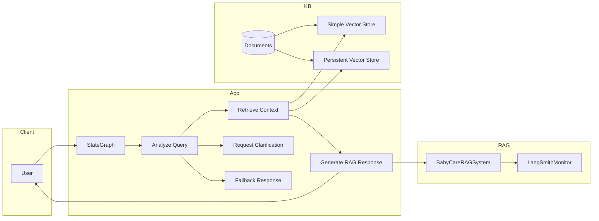
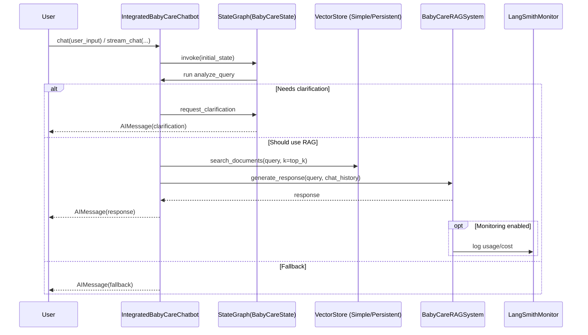

## BabyCare Chatbot Architecture

This document outlines the high-level architecture of the Integrated Baby Care Chatbot with RAG.

### Components Overview
- **IntegratedBabyCareChatbot**: Orchestrates the chat flow using LangGraph `StateGraph` and routes between clarification, RAG, and fallback.
- **BabyCareRAGSystem**: Generates responses using retrieved context; integrates optional `LangSmithMonitor` for usage/cost tracking.
- **Vector Store**: `SimpleBabyCareVectorStore` (in-memory) or `BabyCareVectorStore` (persistent) selected via `config.use_memory_vector_store`.
- **Knowledge Base**: Ingested from PDFs and other files, or seeded via `create_sample_baby_care_documents()`.

### High-level Architecture

### Request Flow (Sequence)

### Notes
- Initialization optionally seeds the KB when empty via `create_sample_baby_care_documents()`.
- `get_knowledge_base_info`, `get_rag_keywords`, and `search_knowledge_base` expose useful diagnostics and search endpoints.
- Ingestion helpers: `add_documents`, `add_pdf_folder`, `add_documents_from_folder`.

